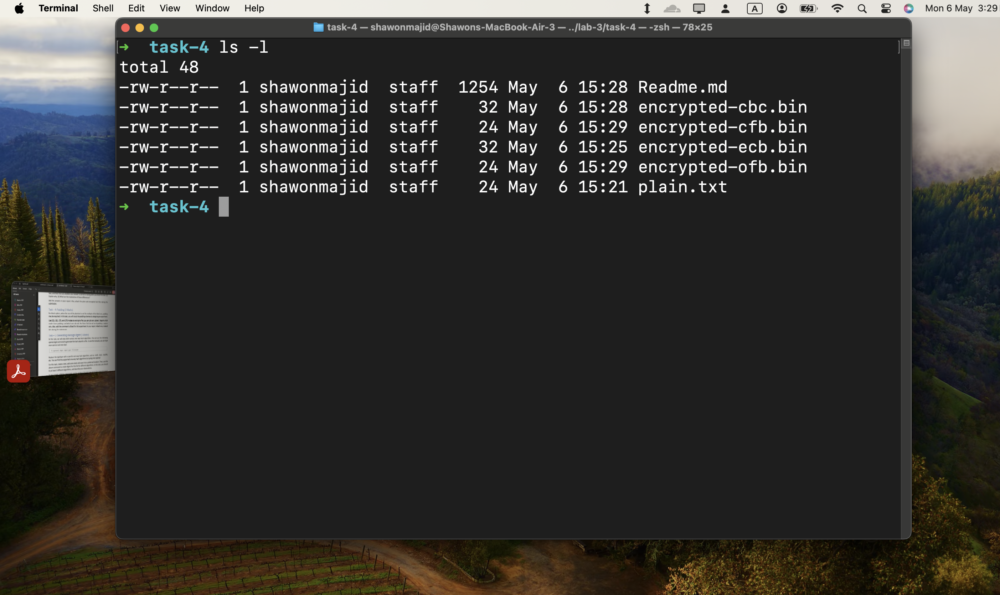

## Task 3

To study the padding scheme let's select the `AES` as the block cipher.
The block size of `AES-128` is _128_ bit or _16 Bytes_. Steps for testing with this algorithm are following:

1. Create a text file that has a size which is not multiple of 16. The size can be checked using `ghex`.
2. Now Encrypt using the following commands.

   1. Using `ECB mode`
      **Encrypt:**

   ```bash
   openssl enc -aes-128-ecb -e  -in plain.txt -out encrypted-ecb.bin -K 00112233445566778889aabbccd3322a
   ```

   2. Using `CBC mode`:
      **Encrypt:**

   ```bash
   openssl enc -aes-128-cbc -e  -in plain.txt -out encrypted-cbc.bin \
                   -K  00112233445566778889aabbccddeeff \
                   -iv 01020304050607083241231213124f23
   ```

   3. Using `CFB mode`:
      **Encrypt:**

   ```bash
   openssl enc -aes-128-cfb -e  -in plain.txt -out encrypted-cfb.bin \
                   -K  00112233445566778889aabbccddeeff \
                   -iv 01020304050607083241231213124f23
   ```

   4. Using `OFB mode`:
      **Encrypt:**

   ```bash
   openssl enc -aes-128-ofb -e  -in plain.txt -out encrypted-ofb.bin \
                   -K  00112233445566778889aabbccddeeff \
                   -iv 01020304050607083241231213124f23
   ```

### The results & analysis


**Observations**:

Here the plain text size was 24 bytes. And `CFB` & `OFB` encrypted files are also 24 bytes. Which means no padding is needed for these algorithms

But however, `ECB` & `CBC` algorithm made the size of encrypted file 32 Bytes which is a multiple of 16 (Block size of AES-128). So here padding is needed incase of these 2 algorithms.
